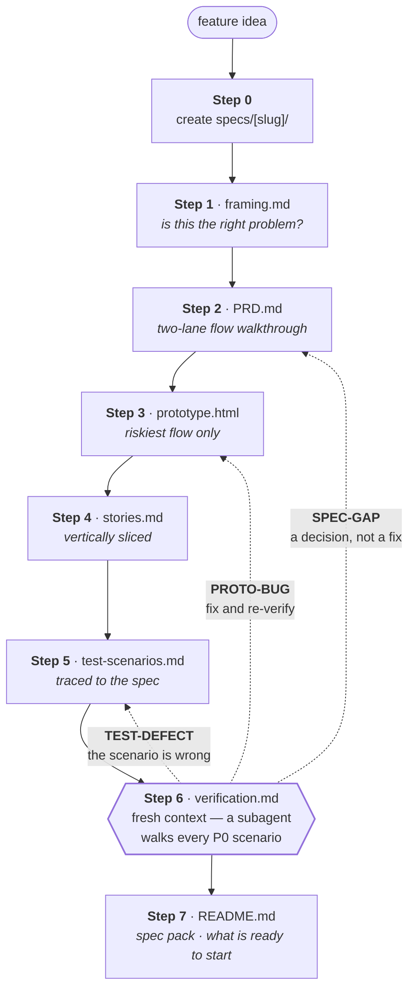

# Skilled Worker

A plugin marketplace of structured AI workflows for knowledge workers — built for
[Claude Code](https://claude.com/claude-code) and Claude Cowork.

Generic prompting gives you text. A skill gives you a repeatable process: the same
framework, the same output shape, every time you ask. Ask for a PRD and you get the
same nine sections, with the questions you skipped marked as skipped, every time.

**Early days — two plugins work today.** `ss-product-management` has eight skills and a
command; `ss-ai-learning` has five. The other two are published as empty scaffolds so
the structure is visible; they install cleanly but do nothing yet. Watch or star the
repo if you want to know when they land.

## Plugins

| Plugin | What it covers | Status |
| --- | --- | --- |
| `ss-product-management` | Research, PRDs, user stories, prototypes, prototype verification, test scenarios, e2e runs, bug reports | **8 skills, 1 command** |
| `ss-job-search` | Role targeting, company research, applications, interview prep | Planned — empty |
| `ss-resume` | Resume review, tailoring to a job description, impact bullets | Planned — empty |
| `ss-ai-learning` | Study plans, concept explainers, practice projects, tool evaluations, research digests | **5 skills** |

### `ss-product-management` skills

| Skill | Produces |
| --- | --- |
| `deep-research` | A sourced answer to a question a decision rests on — researched across several angles at once, every finding attacked before it is believed, ranked by confidence, every claim carrying a link and a date |
| `prd-drafting` | A PRD: problem, users, goals, a two-lane flow walkthrough (what the user sees / how data moves), scoped requirements, metrics, open questions |
| `user-story-creation` | Takes a PRD (or feature) and produces vertically sliced stories with Given/When/Then criteria, INVEST-checked, sequenced, and traced back to requirements |
| `prototype-creation` | Takes a PRD (or story) as context and produces a prototype brief plus a single-file clickable HTML prototype or wireframe spec |
| `prototype-verification` | Checks a prototype against the stories and scenarios it should satisfy — coverage map, scenario walk-through, and every failure sorted into prototype defect, spec gap, or bad scenario |
| `testing-scenarios` | Takes a PRD (or story) and produces a prioritized test pass — happy paths, boundaries, failures, permissions, state transitions — with a traceability table |
| `e2e-testing` | Executes a test pass in a real browser against a running build — local, or a preview/PR deployment for people who do not run it locally — scenario results with screenshot, console and network evidence, flaky calls made honestly, and a bug report per failure |
| `bug-report` | A reproducible bug report with expected vs actual, evidence, and separate severity/priority |

They chain in that order: the PRD is the spine, and the prototype, stories, and test
pass all read it directly; the test pass is executed by `e2e-testing` once there is a
build to run it against, and both that and verification feed bug reports.
`deep-research` sits upstream of all of it — it answers the questions a PRD would
otherwise assume, and its findings land in the PRD carrying their sources.

`deep-research` is built around one idea: research that a decision rests on has to be
auditable. It splits a question into several angles and researches them in parallel
contexts, so agreement between angles means something; it traces repeated claims back
past the citations, because three articles quoting one press release are one source; and
it sends every finding to a skeptic in a fresh context whose job is to disprove it.
What survives is ranked by confidence, contradictions stay contradictions rather than
being averaged into a number no source supports, and what was refuted stays visible with
its reason. Then it stops and waits for you.

Then it loops. Once the stories and scenarios exist, `prototype-verification` walks them
against the prototype and sorts every failure into three piles: the prototype is wrong
(back to `prototype-creation`), the spec is wrong (back to the PRD), or the scenario is
wrong (back to the test pass). Fix, re-check all of them, repeat until the P0 scenarios
pass or it stops converging. A spec nobody has executed is a guess, and this is the
cheapest place to execute one.

Verification is a separate skill on purpose, and it runs in a fresh context — spawn a
subagent and hand it the file paths; no new session required. A context holding the
build conversation knows what each screen was *supposed* to do and reads it as doing
that, so it never grades its own work: the verifier reports and never edits, the builder
fixes and never self-certifies. The report also states what it could not check — a
prototype hardcodes its data, so concurrency, retries, and persistence come back as
`not verifiable here` rather than as a pass.

`e2e-testing` is the other end of that: once a build exists, it drives a real browser
through the same scenarios and reports what the build actually does — and it is built
for people who do not run the app locally. It asks which environment before the first
click, and treats the answer by class rather than by hostname: a preview or PR
deployment is the normal case and gets the full pass, because it is disposable; a shared
staging needs a yes that names it, and skips the destructive scenarios; production is a
refusal, because e2e scenarios submit forms, mutate records and trigger emails, and
"read-only" is not a promise anything clicking through flows can keep. It captures a
screenshot, the console and the failed requests for every failure; it reports a scenario
that failed and then passed as flaky rather than as a pass; and it never edits the app
or the scenario to get a better number. Without a browser tool it says so and stops,
instead of reading the code and describing what would probably happen.

### `ss-product-management` commands

| Command | Runs |
| --- | --- |
| `/spec-feature` | The full chain — PRD, prototype, stories, test pass, then the stories and scenarios run back through the prototype — stopping for review after each artifact |

## Installing

Claude Code CLI:

```bash
claude plugin marketplace add strategysoul/skilled-worker
```

```bash
claude plugin install ss-product-management@skilled-worker
```

Claude Cowork: **Customize → Browse Plugins → Add Marketplace from GitHub**, then
enter the same `strategysoul/skilled-worker`.

Working on the skills themselves? Clone the repo and add it as a local marketplace by
path instead — your edits then apply after `claude plugin marketplace update
skilled-worker`, with no push required.

## Using it

Skills load on their own when what you ask matches what they do. You don't name them:

> "Write up a PRD for letting agencies onboard sub-accounts"
> "Turn this PRD into stories"
> "How should we test this before release?"
> "Something's broken — the submit button spins forever"

The command is explicit, and runs the whole chain with a review stop after each piece:

```
/spec-feature onboarding form for new agency accounts
```

It goes problem framing → PRD → prototype → stories → test pass → verification. That
last step runs the stories and scenarios back through the prototype, so the chain ends
by telling you what the PRD got wrong rather than handing you four documents that agree
with each other because nothing ever tested them.



Solid arrows are the chain, and every one of them is a checkpoint — the artifact is
shown and a decision taken before the next is built on it. The dotted arrows are the
point of the whole thing: Step 6 is the first time anything executes the spec, and each
failure it finds goes back to whoever owns it. `SPEC-GAP` is the valuable one, and it
returns to the PRD as a *question*, never as a fix applied downstream.

Every run makes a folder first and writes each artifact into it as that artifact is
produced:

```
specs/agency-sub-account-onboarding/
├── README.md            # what exists and what state it is in
├── framing.md           # the agreed problem, before any drafting
├── PRD.md
├── prototype.html       # edited in place across verification rounds
├── prototype-brief.md   # what is fake, what is deliberately excluded
├── stories.md
├── test-scenarios.md
└── verification.md      # coverage, results, findings, round log
```

Nothing lives only in the conversation, so the chain survives a session ending
mid-way — point the command at an existing folder and it resumes from the first missing
artifact instead of regenerating what is already there.

### What makes these different from a prompt

The PRD skill produces a **two-lane flow walkthrough**: one numbered sequence showing
what the user sees beside what the system does with the data — payload, states,
failure handling, what is persisted. "Account creation in progress" and
`status=pending` are the same fact in two vocabularies, and a spec containing only one
of them gets the other invented later, differently.

Everything downstream reads that walkthrough. Stories slice it, tests verify it,
prototypes render it — and each one reports back what the PRD got wrong.

### `ss-ai-learning` skills

For three overlapping situations: learning AI well enough to make decisions about it,
learning to build with it, and keeping up without drowning.

| Skill | Produces |
| --- | --- |
| `ai-study-plan` | A learning path with a demonstrable capability target, an artifact per unit, and a stopping rule |
| `ai-concept-explainer` | An explanation pitched at the decision behind the question, with the mechanism, the failure modes, and where the analogy breaks |
| `ai-practice-project` | A hands-on project scoped to the hours available, with milestones, what to observe at each, and spend guardrails |
| `ai-tool-evaluation` | An adopt/pass/pilot decision with criteria set before testing, measured against your own data and a real baseline |
| `ai-research-digest` | A paper or release cut down to the claim, the evidence, what is genuinely new, and act/watch/ignore |

The through-line: none of them let you mistake reading for capability. Study units are
done when an artifact exists, projects tell you what to *look at* rather than what to
build, evaluations set thresholds before the demo, and digests are allowed to conclude
"this changes nothing for you".

## Skills vs. commands

Two different things, and the difference matters:

- **A skill** (`<plugin>/skills/<name>/SKILL.md`) is a reusable framework. It is
  *model-invoked* — Claude loads it on its own when the user's request matches the
  skill's `description`. That description is the entire trigger, so it must name the
  situations and phrases a real user would type.
- **A command** (`<plugin>/commands/<name>.md`) is a `/slash` workflow the user runs
  deliberately. Its job is to sequence several skills into one end-to-end deliverable.

A skill should stand alone. A command should not duplicate a skill's content — it
should point at it.

## Repository layout

```
skilled-worker/
├── .claude-plugin/
│   └── marketplace.json          # every plugin listed here, or it doesn't install
├── ss-product-management/
│   ├── .claude-plugin/
│   │   └── plugin.json           # name, version, description, keywords, license
│   ├── skills/
│   │   └── <skill-name>/SKILL.md
│   └── commands/
│       └── <command-name>.md
├── ss-job-search/                # same shape
├── ss-resume/                    # same shape
├── ss-ai-learning/               # same shape
├── templates/                    # copy these when adding a skill or command
│   ├── SKILL.md
│   └── COMMAND.md
├── validate_plugins.py           # manifest + frontmatter checks
├── CLAUDE.md                     # conventions Claude should follow in this repo
└── CONTRIBUTING.md               # how to add a skill
```

## Adding a skill

```bash
mkdir -p ss-resume/skills/tailor-to-job
cp templates/SKILL.md ss-resume/skills/tailor-to-job/SKILL.md
```

Fill in the template, then validate:

```bash
python validate_plugins.py
```

The directory name and the frontmatter `name` must match — the validator enforces it.

## Contributing

Issues and pull requests are welcome — especially reports that a skill *didn't fire*
when it should have. A skill loads based on its `description` alone, so a description
that doesn't match how people actually phrase things is the most common defect here,
and it's invisible to the author.

See [CONTRIBUTING.md](CONTRIBUTING.md) for how to add a skill, and
[CLAUDE.md](CLAUDE.md) for the writing conventions this repo follows.

Structure is checked in CI:

```bash
python validate_plugins.py
```

## License

MIT — see [LICENSE](LICENSE).
